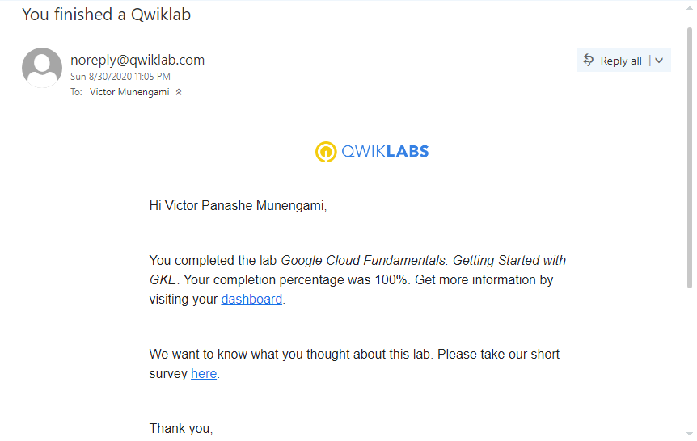
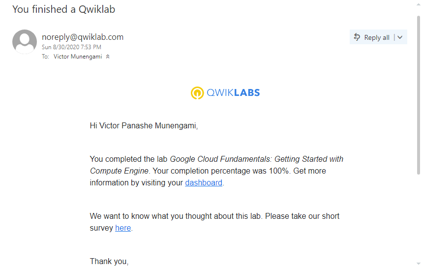

# GADS2020-PROJECT_PRACTICE_SUBMISSION

 
Lab 1: VPC NETWORKS

  
  

 
Lab 2: GETTING STARTED WITH GKE

  
  

 
Lab 3: GETTING STARTED WITH COMPUTE ENGINE

  
  

 
Lab 4: SETTING UP A DEV ENVIROMEMENT 1.1

  
  

 
Lab 5: INFRASTRUCTURE PREVIEW

  
  

 
Lab 6: GETTING STARTED WITH APP ENGINE

  
  

 
Lab 7: GOOGLE CLOUD MARKET PLACE

  
 

 
Lab 8: CLOUD STORAGE & SQL

  
 

 
Lab 9: CONSOLE AND CLOUD SHELL

  
 

 
Lab 10: CLOUD SQL & DATAPROC

  
 

 
Lab 11: Classify Images with Pre-built ML Models using Cloud Vision API and AutoML.

  
 

